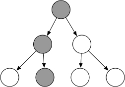

### React数据流

在react中，数据是自顶向下单向流动

如果顶层组件初始化`props`，那么React会向下遍历整个组件树，重新尝试渲染所有的相关子组件。而`state`只关心每个组件自己内部的状态，这些状态只能在组件内改变

`setState`是一个异步方法，一个生命周期内所有的`setState`方法会合并操作

在react中有一个重要且内置的props——children，它代表组件的子组件集合。children可以根据传入子组件的数量决定是否是数组类型

```html
<Tabs>
  children={[
    <Tabpane>1</Tabpane>
    <Tabpane>2</Tabpane>
    <Tabpane>3</Tabpane>
  ]}
</Tabs>
```

`propTypes`和`defaultProps`分别代表props类型检查和默认类型，这两个属性被声明成静态属性，意味着从类外面也可以访问它们，例如`App.propTypes`和`App.defaultProps`

### React生命周期

如果组件自身的state更新，那么一次会执行`shouldComponentUpdate`、`componentWillUpdate`、`render`、`componetnDidUpdate`

当父节点props改变时，在理想情况下，子需要渲染一条链路上相关props改变的节点即可



但是在默认情况下，React会渲染所有节点，因为`shouldComponentUpdate`默认返回true，这也意味着无状态组件总是会被渲染（因为其没有生命周期），为了让无状态组件不被重复渲染，我们可以使用`PureComponent`（React15.3中新加）


如果组件是由父组件更新`props`而更新，那么在`shouldComponentUpdate`之前会执行`componentsWillReciveProps`方法，此方法可以作为React在props传入之后，渲染之前setState的机会，在此方法中调用`setState`不会二次渲染

### ReactDOM

DOM被真正添加到HTML中的生命周期方法是`compontentDidMount`和`componentDidUpdate`。在这两个方法中我们可以使用ReactDOM提供的方法`findDOMNode`获取真正的DOM元素。

* `findDOMNode`返回该React组件实例相应的DOM节点
* `findDOMNode`只对已经挂载的组件有效

利用render方法可以得到App组件的实例，然后对它进行一些操作

```js
const myApp = ReactDOM.render(<App/>, documnet.getElementById('root'))
```

但是在组件内JSX不会返回一个组件的实例，它只是一个ReactElement，想要拿到组件的实例，需要使用`refs`，组件被调用时会新建一个该组件的实例，而`refs`指向这个实例

```js
<input ref={ref => this.myInput = ref}/>
// or
<input ref='myInput'/>
```


所以，`refs`拿到的是组件的引用而`findDOMNode`则是拿到真正的DOM

#### 注：

* 为防止内存泄漏，当一个组件卸载时，组件里的所有refs会变成null
* `findDOMNode`和`refs`都无法用于无状态组件，原因在于无状态组件挂载时只是方法调用，没有新建实例