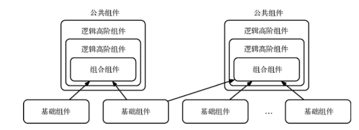

#### 事件委派

React事件系统并不会把事件处理函数直接绑定到真实的节点上，而是把所有的时间绑定到结构的**最外层**，使用一个统一的事件监听器，这个事件监听器上维持了一个映射来保存所有的组件内部的事件监听和处理函数。当组件挂载或卸载时，只是在这个统一的事件监听器上插入或删除一些对象

#### 自动绑定

在React中，每个方法的上下文都会有指向该组件的实力，即自动绑定this为当前组件，而且React还会对这种应用进行缓存。在使用ES6 class或者纯函数时，这种自动绑定就不存在了，需要手动绑定this。

1.bind绑定

如果只绑定不传参可以使用stage 0草案的双冒号绑定 `<div onClick={::this.click}>test</div>`

2.构造器内绑定

```js
class App extends Component {
    handleClick () {
        this.handleClick = this.handleClick.bind(this)
    }
}
```

3.箭头函数

#### React中使用原生事件

React中使用DOM原生事件时，一定要在**组件卸载时手动移除**，否则可能出现内存泄漏。而使用合成事件则不需要，React内部已经处理过了

#### 组件间通信

没有嵌套关系的组件，在`componentDidMount`事件中，如果组件挂载完成，再订阅事件；当组件卸载的时候，在`componentWillUnmount`事件中取消事件订阅

#### 组件间抽象

##### mixin

mixin原理如下：

```JS
const mixin = function (obj, mixins) {
  const newObj = obj
  newObj.prototype = Object.create(obj.prototype)

  for (let prop in mixins) {
    if (mixins.hasOwnProperty(prop)) {
      newObj.prototype[prop] = mixins[prop]
    }
  }

  return newObj
}

const BigMixin = {
  fly: () => {
    console.log('test')
  }
}

const Big = function () {
  console.log('new big')
}

const newBig = mixin(Big, BigMixin)

console.log(new newBig()) // => new big
console.log(newBig.fly()) // => test
```

##### 高阶组件

实现高阶组件的方法有如下两种：

- 属性代理。高阶组件通过被包裹的React组件来操作props
- 反向继承。高阶组件继承于被包裹的React组件

**属性代理**

```javascript
import React, { Component } from 'React';
const MyContainer = (WrappedComponent) => class extends Component {
    render() {
        return <WrappedComponent {...this.props} />;
    }
}
```

render中返回了传入的WrappedComponent的React组件。这样，就可以通过高阶组件来传递props，这样的方法称为属性代理

当使用属性代理构建告诫组件时执行生命周期的过程类似于堆栈调用：

didmount -> HOC didmount -> (HOCs didmount) -> (HOCs will unmount) -> HOC will unmount -> unmount

**反向继承**

```javascript
const MyContainer = WrappedComponent =>{
  class extends WrappedComponent {
    render() {
      return super.render()
    }
  }
}
```

高阶组件继承于`WrappedComponent`，因此被动地继承了`WrappedComponent`，所有的调用都会反向。

反向继承通过继承`WrappedComponent`来实现，方法可以通过`super`顺序调用，因为依赖于继承机制，HOC的调用顺序和**队列**一样

didmount→HOC didmount→(HOCs didmount)→will unmount→HOC will unmount→(HOCs will unmount)

在反向继承方法中，高阶组件可以使用 WrappedComponent 引用，这意味着它可以使用
WrappedComponent 的 state、props 、生命周期和 render 方法。但它不能保证完整的子组件树被解析。

*渲染劫持

渲染劫持指的就是高阶组件可以控制 WrappedComponent 的渲染过程，并渲染各种各样的结 果。我们可以在这个过程中在任何 React 元素输出的结果中读取、增加、修改、删除 props，或 读取或修改 React 元素树，或条件显示元素树，又或是用样式控制包裹元素树。

```javascript
const MyContainer = WrappedComponent => {
  class newComponent extends WrappedComponent {
    render() {
      const elementsTree = super.render()
      let newProps = {}
      if (elementsTree && elementsTree.type === 'input') {
        newProps = { value: 'may the force be with you' }
      }
      const props = Object.assign({}, elementsTree.props, newProps)
      const newElementsTree = React.cloneElement(
        elementsTree,
        props,
        elementsTree.props.children
      )
      return newElementsTree
    }
  }
}
```

在这个例子中，WrappedComponent 的渲染结果中，顶层的 input 组件的 value 被改写为 may the force be with you。

*控制state

高阶组件可以读取、修改或删除 WrappedComponent 实例中的 state，如果需要的话，也可以 增加 state。但是大部分的高阶组 件都应该限制读取或增加 state，尤其是后者，可以通过重新命名 state，以防止混淆。

```javascript
const MyContainer = WrappedComponent => {
  class newComponent extends WrappedComponent {
    render() {
      return (
        <div>
          <h2>HOC Debugger Component</h2>
          <p>Props</p> <pre>{JSON.stringify(this.props, null, 2)}</pre>{' '}
          <p>State</p>
          <pre>{JSON.stringify(this.state, null, 2)}</pre> {super.render()}
        </div>
      )
    }
  }
}
```

(JSON.stringify的使用)[https://developer.mozilla.org/zh-CN/docs/Web/JavaScript/Reference/Global_Objects/JSON/stringify]

组件参数

有时候需要用高阶组件传入一些参数，这可以用非常简单的方式来实现

```js
import React, { Component } from 'React'
function HOCFactoryFactory(...params) {
  // 可以做一些改变 params 的事
  return function HOCFactory(WrappedComponent) {
    return class HOC extends Component {
      render() {
        return <WrappedComponent {...this.props} />
      }
    }
  }
}
```

使用时候

```js
HOCFactoryFactory(params)(WrappedComponent)

// or

@HOCFatoryFactory(params)
class WrappedComponent extends React.Component{}
```

##### 组合式组件开发



#### 组件性能优化

##### key

如果每一个子组件是一个数组或者迭代器的话，那么必须有一个唯一的key props。key的作用是当数据发生变化导致列表发生变化时候，key被用来当作唯一标识。

通常我们会这么写

```javascript
import React, { Component } from 'react';
import { render } from 'react-dom';

class List extends Component {
  render() {
    return (
      <ul>
        {
          list.map((item, index) => {
            return <li key={index}>{item}</li>
          })
        }
      </ul>
    )
  }
}
```

把key设置成序号，这么做可以不再让react警告，但这是非常低效的做法。我们在生产环境下常常犯这样的错误，这个 key 是每次用来做 Virtual DOM diff 的，每一位同学都用序号来更新的问题是它没有和同学的唯一信息相匹配，相当于用了一个随机键，那么不论有没有相同的项，更新都会重新渲染。

正确的做法也很简单，只需要把 key 的内容接口返回的每项数据的唯一标识，例如sid:

```javascript
import React, { Component } from 'react';
import { render } from 'react-dom';

class List extends Component {
  render() {
    return (
      <ul>
        {
          list.map((item, index) => {
            return <li key={item.sid}>{item}</li>
          })
        }
      </ul>
    )
  }
}
```

当key相同的时候，React只会渲染第一个相同key的项，且会报一个警告：

```shell
Warning: flattenChildren(...): Encountered two children with the same key, `.$a`. Child keys must be unique;
when two children share a key, only the first child will be used.
```

因此，对 key 有一个原则，那就是独一无二，且能不用遍历或随机值就不用，除非列表内容也并不是唯一的表示，且没有可以相匹配的属性。